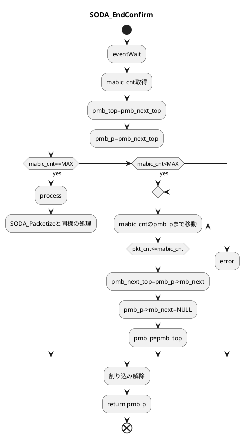

# SODA_driver フローチャート

### SODA_EndConfirm

```plantuml
@startuml
title SODA_EndConfirm
start
:eventWait;
:mabic_cnt取得;
:pmb_top=pmb_next_top;
:pmb_p=pmb_next_top;
if (mabic_cnt==MAX) then(yes)
    :process;
    :SODA_Packetizeと同様の処理;
else if(mabic_cnt<MAX) then(yes)
    repeat
     :mabic_cntのpmb_pまで移動;
    repeat while (pkt_cnt<=mabic_cnt)
    :pmb_next_top=pmb_p->mb_next;
    :pmb_p->mb_next=NULL;
    :pmb_p=pmb_top;
else
    :error;
endif
:割り込み解除;
:return pmb_p;
end
@enduml
```