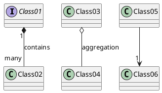
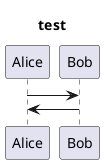
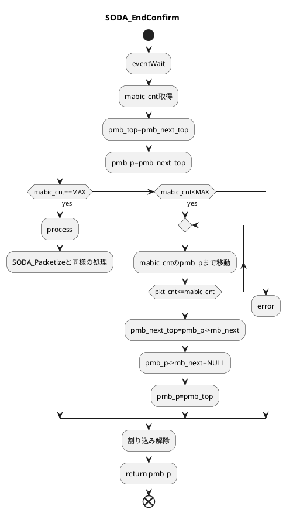

# plantUML 

* reference

https://plantuml.com/ja/class-diagram

---
### Class 
```plantuml
@startuml

note right of api : Interface.
api "1"---"1" driver 
driver "1"---"1" mngr 
api "1"---"1" mngr 
mngr "1" o--"0..*" mbuf 
mbuf  <|-- EXTINY 
mbuf  <|-- LARGE 
api : SODA_Init()
api : SODA_Uninit()
api : SODA_Exec()
api : SODA_EndConfirm()
api : SODA_Config()
api : outnum 
api : setnum 
api : getnum 
note top of driver : drive SODA and mabic, TSUMXD.
driver : struct hdrinfo
driver : struct conf 
driver : set_param() 
note bottom of mngr : manage mbuf list.
mngr : i_nextpkt
mngr : o_nextpkt 
mngr : o_pkt
mngr : create_mblist()
mngr : trim_mblist()
mbuf : mbuf_get()
@enduml
```




---
### Sequence

---
### Fllow Chart 

